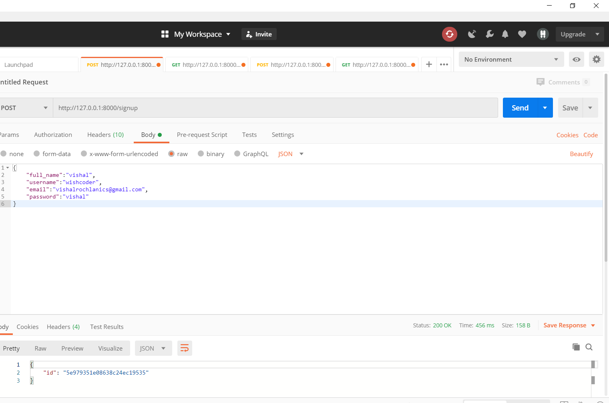
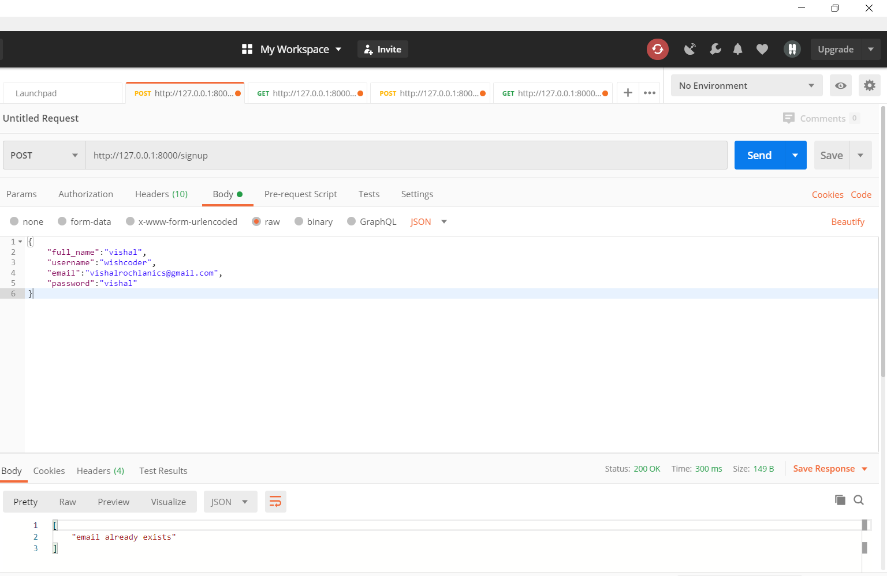
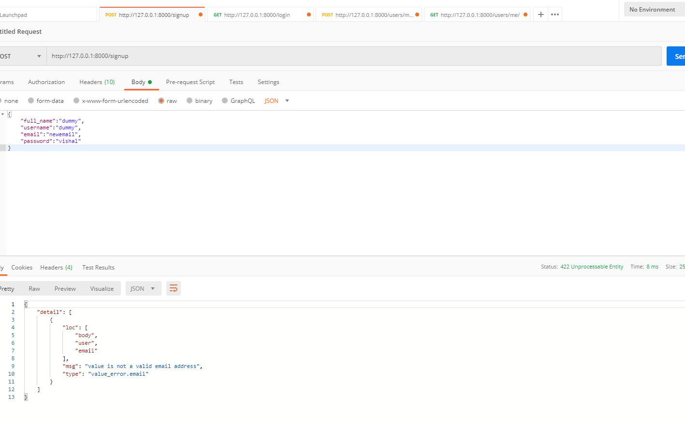
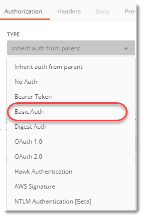
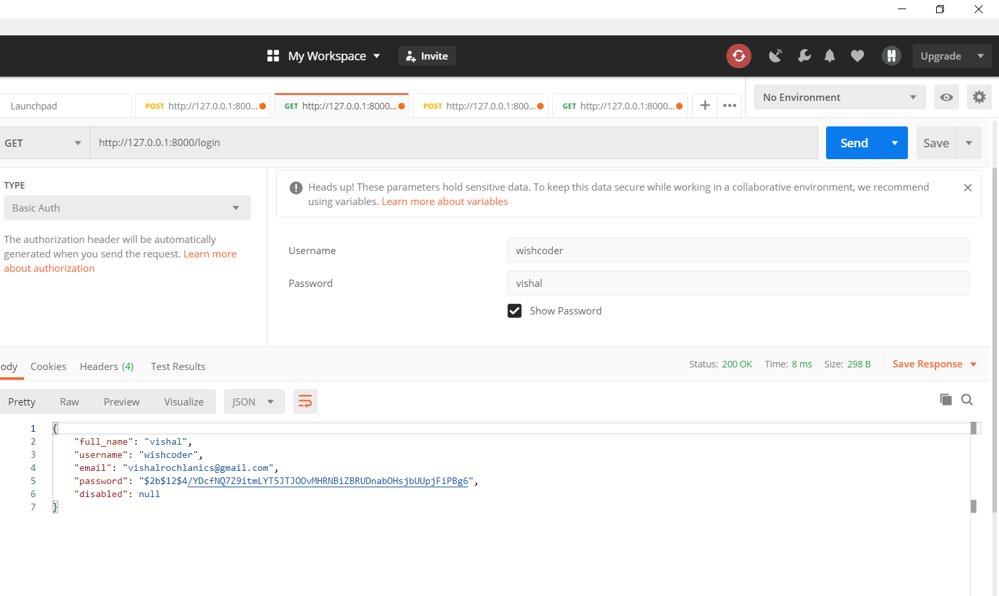
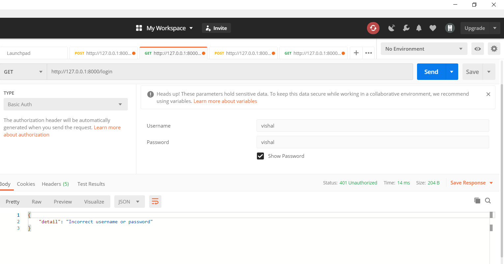
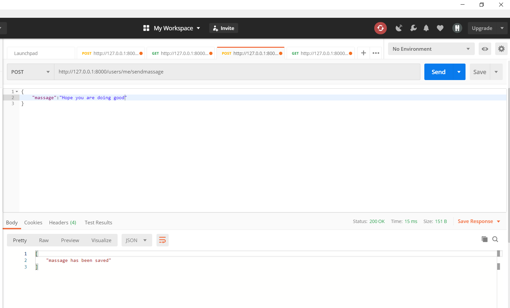
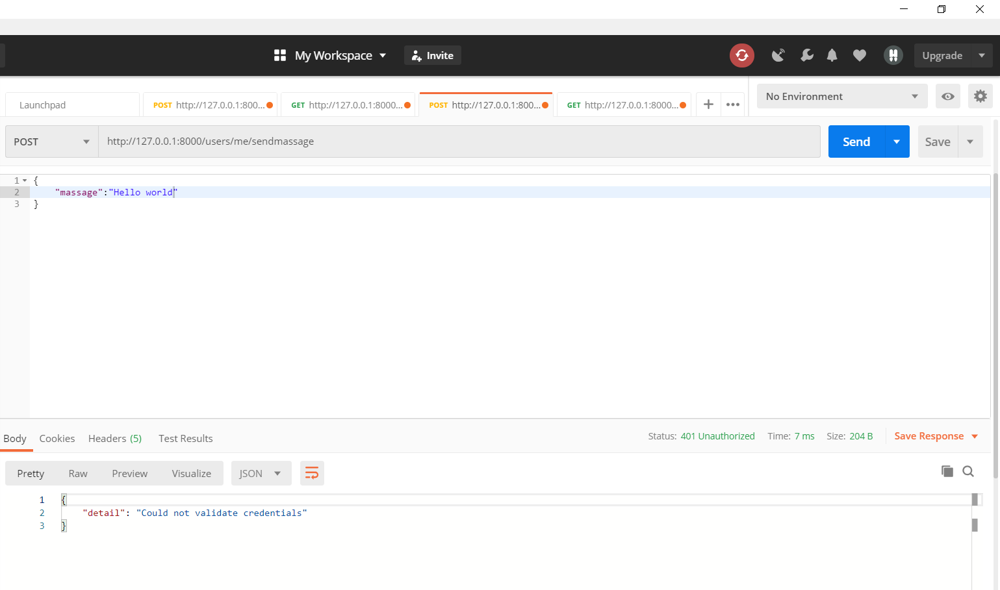
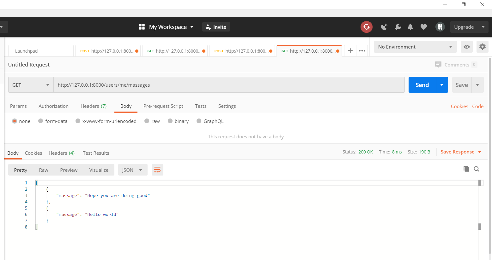
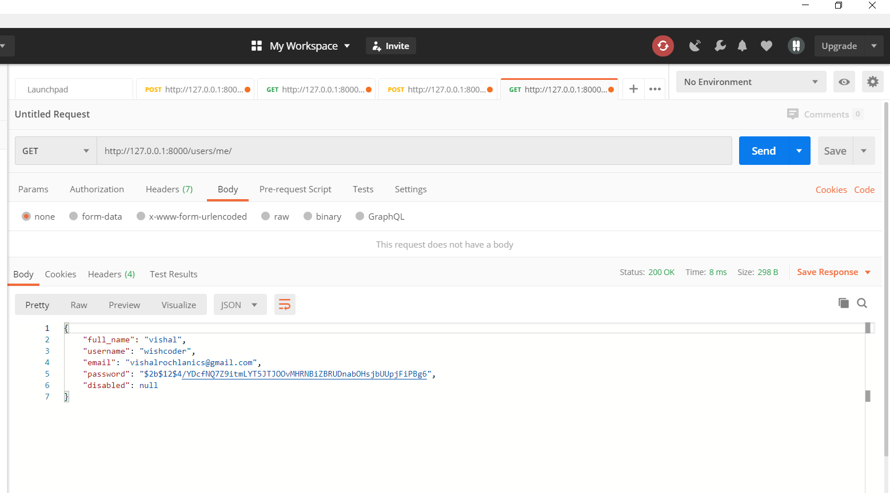

# User Authentication and text saving api using FASTapi and Mongodb

The API is built by using FASTapi framework, This api uses OAuth2 Authentication protocol,OAuth2 is a specification that defines several ways to handle authentication and authorization.Login api uses "JSON Web Tokens" i.e. JWT and hashing password using hashing algorithms for security.

# Installing

Clone the repository and then run the following command to install all the libraries.

```
    $ pip install -r requirements.txt
```

Or you can directly install all libraries one by one by using the below commands for windows operating system. 

firstly install fastapi.
```
    $ pip install fastapi
```
install uvicorn to run the fastapi application.

```
    $ pip install uvicorn
```
install jwt for python.
```
   $ pip install pyjwt
```

install pymongo

```
    $ pip install pymongo
```

install pytest for testing of api
```
    $ pip install pytest
```

# Getting Started

To run the API in local machine run the following command.

```
    $ uvicorn main:app --reload
```
The application will run on http://127.0.0.1:8000/

Now to test the API open a API testing tool such as Postman.


# Sign Up

In postman send a json in a POST request to http://127.0.0.1:8000/signup/ url.
The format of json should be.
```
{
    "full_name": string,
    "username": string,
    "email": email_string,
    "password": string,
}
```


The response will be a json object which contains the ObjectId corresponding to the signed up user which get stored in mongodb user collection, that shows that the signup is successfully executed.
If the email already exists a error message in the json format get displayed.



If the username already exists a error message in the json format get displayed.


If the request json format as described is wrong or email id format is wrong an error message get displayed.



# Login

Now to login send a Basic Auth in Authorization section using Postman 





Now put the username and password in the Basic Auth Credentials form and sent a GET request to http://127.0.0.1:8000/login/ url .



If the credentials were correct the user will be redirected to http://127.0.0.1:8000/users/me/ url with a json response of details of user.

If credentials were wrong an error message get displayed.



# text saving 

to save a text user need to login first if not logged in an error message will be displayed.

After login send the message in the jason by POST request to http://127.0.0.1:8000/users/me/sendmassage url in the following format.

```
{
    "massage": string
}
```


If user is not logged in the error message get displayed.




# Get all the texts of the logged in user

To get all the texts in the json format send a GET request to http://127.0.0.1:8000/users/me/massages/ url.

The response will be a json of all the messages stored by user.



# Get details of current logged in user

To get the details of current logged in user send a GET request to http://127.0.0.1:8000/users/me url.

A json response will be sent with details of user if user in not logged-in an error message will get displayed.




# Testing

For testing install pytest library then run pytest in command prompt in the same directory.
_test_main.py_ will automatically get executed and testing will get perform.


Thank you!!!


